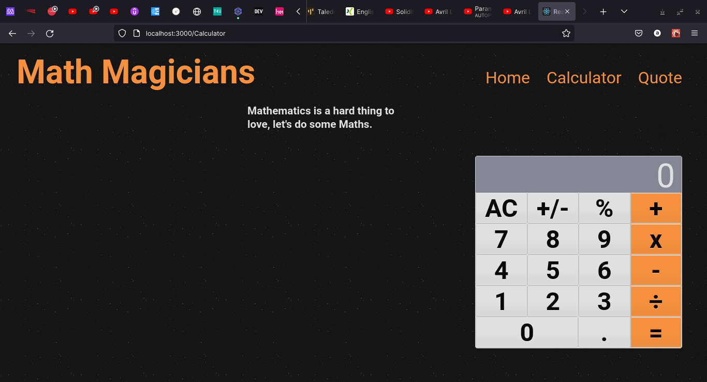

# Math Magicians

> "Math magicians" is a website for all fans of mathematics. It is a Single Page App (SPA) that allows users to:

- Make simple calculations.
- Read a random math-related quote.

This application is built using React and Bootstrap.

## Preview

## Built With

- React
- JSX
- CSS

## Getting Started

To get this project up and running, follow these simple steps:

1. Clone the repository into your machine.
2. Open the project's folder with your preferred source-code editor.
3. Run `yarn`.
4. Run `yarn start`.

### Prerequisites

- Any modern web browser.
- Any source-code editor (VSCode recommended).
- npm and yarn installed

### Setup

- Follow the steps described before.

## Authors

👤 **Iyunda Ismael Antonio**

- GitHub: [@ixboy](https://github.com/ixboy)
- Twitter: [@ismaelixboy](https://twitter.com/ismaelixboy)
- LinkedIn: [ismael-antonio](https://www.linkedin.com/in/ismaelantonio/)

## 🤝 Contributing

Contributions, issues, and feature requests are welcome!

Feel free to check the [issues page](https://github.com/ixboy/Math_Magicians/issues).

## Show your support

Give a ⭐️ if you like this project!
